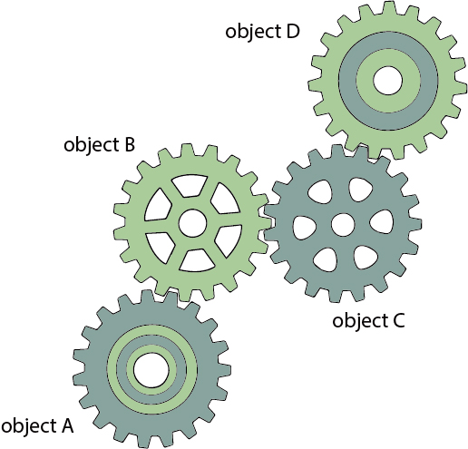

# IocAndDi
# 控制反轉(Inversion of Control)與依賴注入(Dependency Injection)
 
SpringMVC是Spring這個框架的網頁版，而Spirng是目前Java使用常見的框架， 在本篇不會以細說Spring，而是將SpringMVC的重點作為整理，畢竟網上已經有許多Spring的詳細說明， 在此會將SpringMVC做一個重點整理，使一般有Java基礎的設計師可以快速上手。
* * * 
##耦合度(Coupling，dependency)
 
在理解Spring的控制反轉以前，要先從「耦合度」開始說起，耦合度則是物件導向概念中關聯性的代名詞，
 在物件導向中，每個物件都會有牽扯到另一個物件的關聯，這會影響到耦合度。
 
 

 
 
例子上可以看到，一般的物件導向，物件之間是有很強的互相關聯，如果是
 
objectC或者objectB掛掉，那麼整個程式幾乎會停止運作，而如果我objectA需要objectC物件時，又必須要從objectB得到，這樣就是高耦合度。
 
 
為了降低耦合度，於是有了控制反轉（Inversion of Control）的概念。
* * * 
##控制反轉(Inversion of Control)
 
 

 
 
所謂的控制反轉概念，就是由一個container(容器)去關聯所有物件， 如圖，直接加入一個container(容器)去控制所有物件， 如此一來，譬如objectC需要objectB時，只要呼叫容器，就會直接注入到另外一個物件，就像是一個所有物件的溝通角色。
 
 
這樣的做法就可以做到低耦合度。
 
 
重點：
 
 
<ul>
<li>耦合度是物件與物件的關聯性，越高表示關聯性越高，高低會影響到程式的運行。</li>
<li>控制反轉（Inversion of Control）是一個概念，目的是為了降低耦合度，而做法就是使用一個容器，一個代理者。</li>
</ul>
 
原先的程式設計方式是從頭到尾都必須由使用者控制，稱為正轉， 然而控制反轉在於，將控制權交給了容器，於是當本來的控制全交給容器，就稱為反轉。
 
 
簡單說：
 
 
<ul>
<li>正常：物件A對物件B請求，請求物件B給予物件A東西</li>
<li>反轉：容器請求物件B給物件A東西，物件A不需要再去對物件B請求，只要收東西就好，也就是物件A的控制權給容器，反轉控制。</li>
</ul>
* * * 
##依賴注入(Dependency Injection)
 
了解控制反轉的概念，與控制反轉關聯的則是依賴注入(Dependency injection)。
 
###關於依賴性
所謂的依賴即是某類別中有另一個類別的實例，這在物件導向中即是，物件中生出了另外一個物件，
 
 
譬如ClassA中new出ClassB的物件，那麼這兩者就有依賴關係，這也是物件導向當中常見的使用方式之一，也就是像前面提到的耦合度高。
 
 
接著看NormalProject這個範例：
 
###Class Gun:
<pre>
public class Gun {

	public void getBullet() {
		Bullet bullet = new Bullet();
	}

	public void shoot() {
		System.out.println("GunShoot!!");
	}

}</pre>
###Class Bullet:
<pre>
public class Bullet {

	public Bullet() {
		System.out.println("Get a bullet!");
	}
} </pre>
###Class Fire:
<pre>
public class Fire {

	public static void main(String args[]) {

		Gun gun = new Gun();
		gun.getBullet();
		gun.shoot();

	}

}</pre>
範例來說，建立了一個槍(Gun)類別，在建立一個子彈(Bullet)類別，從槍類別中的建構式把子彈new出來，彼此間就是依賴關係，這就是依賴性。
 
 
如果要修改子彈的屬性，譬如把new Bullet()帶參數進去改成new Bullet(String fire)，這樣勢必要修改Bullet這個類別的內容。
 高耦合度，如前面提到，因為關聯性強，除了難修改外，也不利於測試，不容易除錯等等。
***
##關於依賴注入
依賴注入是一種行為，一樣是把依賴關係建立起來，不再需要new出物件實體，這樣的行為依賴注入。
 
 
譬如上方的Gun要在建構式內new出物件才能成立，依賴注入就是透過外部直接傳入的方式導入另一個物件。
 
 

 
 
一個是new出物件實體，這麼一來會直接初始化，可是會有個問題，如果直接new出實體，那麼就不會知道該物件實做了哪些事情，
 
因為有關連性，換句話說，我們雖然知道Gun實作了Bullet，但卻不知道Bullet做了什麼，除非去檢查Bullet這個類別的程式檔。
 
 
NotUseIocAndDi範例：
 
###Class IceGun:
<pre>
  public class IceGun {
	  public void shoot() { // IceGun Shoot method
          System.out.println("Ice Shoot!");
      }
  }</pre>
###Class LaserGun:
<pre>
public class LaserGun {

	public void shoot() { // LaserGun Shoot method
		System.out.println("shoot shoot shoot");
	}
}</pre>
###Class Human:
<pre>
public class Human {

	public Human() {
		LaserGun lasergun = new LaserGun(); // get a lasergun
		lasergun.shoot();// lasergun shoot

		IceGun icegun = new IceGun();// get a icegun
		icegun.shoot();// icegun shoot
	}
}</pre>

如果沒有依賴注入，換別把槍的時候，勢必要修改Human這個類別內的物件，我們從Fire類別執行，new出Human物件並執行，
 
這時它會從Human執行雷射槍的方法，但如果當雷射槍執行完，要成別隻槍呢？只是一個人還好，修改一次Human即可。
 
可是如果有一百個人，那不但要從Fire把這一百人加入，還要再修改Human，因為每個Human的槍不一樣，這樣修改就極為麻煩。
 然而這就是沒有加入控制反轉與依賴注入的狀況，耦合度很高而不容易更改。 
 所以接下來，使用依賴注入的概念：
 
###Interface Gun:現在換成一個介面，不進行實作
<pre>
public interface Gun {
	public void shoot();
}</pre>
###Class IceGun:實作介面的方法
<pre>
public class IceGun implements Gun {

	@Override
	public void shoot() {
		System.out.println("IceGun Shoot!");
	}
}</pre>
###Class LaserGun:實作介面的方法
<pre>
public class LaserGun implements Gun {

	@Override
	public void shoot() {
		System.out.println("LaserGun Shoot!");
	}
}</pre>
###Class Human:不直接實作，一樣給了方法
<pre>
public class Human {
	Gun gun;

	public void shoot() {
		gun.shoot();
	};

	public Gun getGun() {

		return gun;
	}

	public void setGun(Gun gun) {

		this.gun = gun;
	}
}</pre>
###Class Fire:進行攻擊
<pre>
//imitate container 
public class Fire {

	public static void main(String[] args) {
		Human human = new Human();
		// this human get LaserGun
		human.setGun(new LaserGun());
		human.shoot();
		// change to IceGun
		human.setGun(new IceGun());
		human.shoot();

	}

}</pre>
 
加入控制反轉與依賴注入的概念，變成在實作方法可以隨即的替換武器，不需要跑去修改human這個程式，
 看起來雖然結果一樣，但是透過了介面當作容器，而不是直接實作，
 這樣一來最大的好處是只要透過這個「介面」就可以做更改。
 
 
所以可以看到，控制反轉與依賴注入只是一個概念，普通的java專案就可以把概念實踐。
 
 
以Spring來說，Spring有點像是容器的概念， 
他會直接把物件實作完畢，這時候只要在需要執行的時候直接呼叫物件即可 
就像這個介面，只是以介面當容器它無法實作，
 
 
這就是控制反轉與依賴注入的概念 
利用「容器」來當作依賴對象，降低耦合度，就是控制反轉最大的優點。
